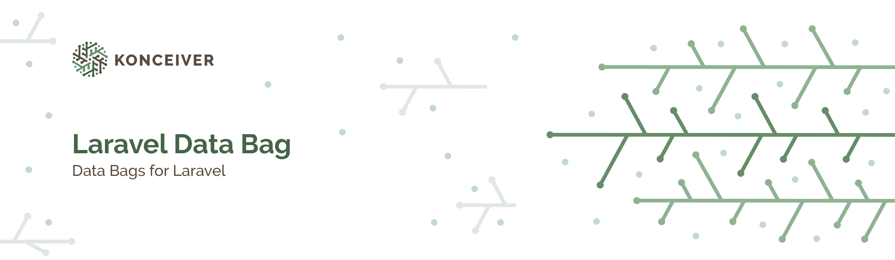

# Laravel Data Bags

<p align="center"></p>

[](https://packagist.org/packages/konceiver/laravel-data-bags)
[](https://packagist.org/packages/konceiver/laravel-data-bags)
[](https://github.com/konceiver/laravel-data-bags/actions?query=workflow%3Arun-tests+branch%3Amaster)
[](https://codeclimate.com/github/konceiver/laravel-data-bags)
[](https://codeclimate.com/github/konceiver/laravel-data-bags)
[](https://packagist.org/packages/konceiver/laravel-data-bags)

This package was created by, and is maintained by [Brian Faust](https://github.com/faustbrian), and provides an easy way of storing generic data that is resolved based on the location.

## Installation

```bash
composer require konceiver/laravel-data-bags
```

## Usage

### Registration & Resolving

``` php
use Konceiver\DataBags\DataBag;

DataBag::register('meta', [
    'users' => ['title' => 'Users'],
    '*'     => ['title' => 'Placeholder'],
]);

Route::get('users', function ($id) {
    // This will return ['title' => 'Users']
    return DataBag::resolveByPath('meta');
});

Route::get('/', function ($id) {
    // This will return ['title' => 'Placeholder']
    return DataBag::resolveByPath('meta');
});
```

### Blade Component

For convenience we offer a Blade component that will make it easy for you to include resolved data into views. We'll use meta tags as an example.

#### Register bag

``` php
use Konceiver\DataBags\DataBag;

DataBag::register('meta', [
    '/' => [
        'title'       => 'My Website',
        'description' => 'Posts, Media & More',
    ],
]);

Route::get('home', function ($id) {
    return view('home');
});
```

#### Create metatag component

```blade
<meta property="og:title" content="{{ $title }}" />
<meta property="og:description" content="{{ $description }}">
```

#### Include data bag component

```blade
<x-data-bag key="meta" resolver="path" view="components.meta" />
```

## Testing

``` bash
composer test
```

## Changelog

Please see [CHANGELOG](CHANGELOG.md) for more information on what has changed recently.

## Contributing

Please see [CONTRIBUTING](CONTRIBUTING.md) for details.

## Security

If you discover a security vulnerability within this package, please send an e-mail to security@konceiver.dev. All security vulnerabilities will be promptly addressed.

## Credits

This project exists thanks to all the people who [contribute](../../contributors).

## Support Us

We invest a lot of resources into creating and maintaining our packages. You can support us and the development through [GitHub Sponsors](https://github.com/sponsors/faustbrian).

## License

Laravel Data Bags is an open-sourced software licensed under the [MIT](LICENSE.md).
